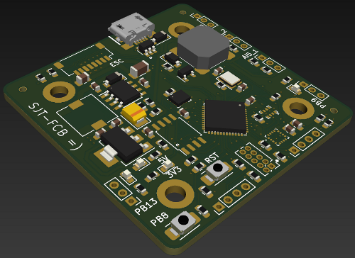

View this project on [CADLAB.io](https://cadlab.io/project/25264).

**PRELIMINARY DESIGN - NOT TESTED - YET**

# sjt-fcb

Drone flight controller designed for hobbyist use. Designed as a part of an embedded design course.

## Features

| Component     | Desc                                                                                                                                                                                                |
| ------------- | --------------------------------------------------------------------------------------------------------------------------------------------------------------------------------------------------- |
| CPU           | [ST STM32F411CEU6](https://www.st.com/resource/en/datasheet/stm32f411ce.pdf)                                                                                                                        |
| IMU           | [ST LSM6DS3](https://content.arduino.cc/assets/st_imu_lsm6ds3_datasheet.pdf)                                                                                                                        |
| Onboard flash | 128 Mb SPI NOR                                                                                                                                                                                      |
| RF Module     | [SiLabs SI4432](https://www.silabs.com/documents/public/data-sheets/Si4430-31-32.pdf) based 315 - 915 MHz [module](https://datasheet.lcsc.com/lcsc/1912111437_DreamLNK-DL-RTS4432-433M_C381165.pdf) |
| Barometer     | [Infineon DPS310](https://www.infineon.com/dgdl/Infineon-DPS310-DataSheet-v01_02-EN.pdf?fileId=5546d462576f34750157750826c42242)                                                                    |
| Magnetometer  | [QST QMC5883L ](https://datasheet.lcsc.com/lcsc/2012221837_QST-QMC5883L_C976032.pdf)                                                                                                                |
|               |                                                                                                                                                                                                     |

- Designed to connect to a
[RaceStar 35A](https://www.racerstar.com/Anniversary-Special-Edition-Racerstar-REV35-35A-BLheli_S-3-6S-4-In-1-ESC-Built-in-Current-Sensor-for-RC-Drone-p-254.html) ESC
- 2.0 mm pitch connectors for external I/O
  - I2C
  - UART
  - 2 x 5V Analog input
  - 1 x 3V Analog input
  - 2 x GPIO
- USB 2.0 connection
- Onboard buzzer
- User programmable button :)